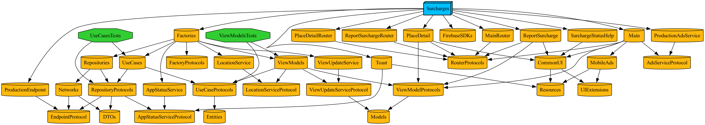

<p align="center">
  
</p>
<p align="center" style="font-weight: bold; font-size: 35px">
Surcharges
</p>
<p align="center">
  <a href="https://apps.apple.com/app/surcharges/id6741091962">
    
  </a>
</p>

This is the repository of iOS App for [Surcharges.nz](https://surcharges.nz) service. Please visit our service and we hope you enjoy it.

## Require external dependency to create a project.
- [Tuist](https://tuist.dev)

> Visit [How to Install](https://docs.tuist.dev/en/guides/quick-start/install-tuist)

And that's all.

## Create Require Files
For hiding sensitive data such as API key, a few files are missing in this repository.

You should create the files before generating the project, following the explanation below.

### EndPoint
There are two modules: `DevelopmentEndpoint` and `ProductionEndpoint` which are endpoints based on the configuration, Dev and Prod. 
In these modules, create `.swift` file and write a code that conforms to `EndpointProtocol`, respectively.

Refer to the example below.
```
import  EndpointProtocol

public struct DevelopmentEndpoint: EndpointProtocol {
  ...
}
```

### AdsService
Also, there are two modules: `DevelopmentAdsService` and `ProductionAdsService` which are Ads information based on the configuration, Dev and Prod.
In these modules, create `.swift` file and write a code that conforms to `AdsServiceProtocol`, respectively.

Refer to the example below.
```
import  AdsServiceProtocol

public struct DevelopmentAdsService: AdsServiceProtocol {
  ...
}
```

## Create the project.
Simpley you can type `tuist generate` in terminal.

If you want to learn more about the command [Click here](https://docs.tuist.dev/en/cli/generate)

## Project Dependency Graph



## Open Issues
Check out the [issues page](https://github.com/Surcharges/iOS/issues/new) to see what we're currently working on.

## Contributing
We welcome pull requests from you! Please let us know in advance by creating an [issue](https://github.com/Surcharges/iOS/issues/new) before submitting your pull request.